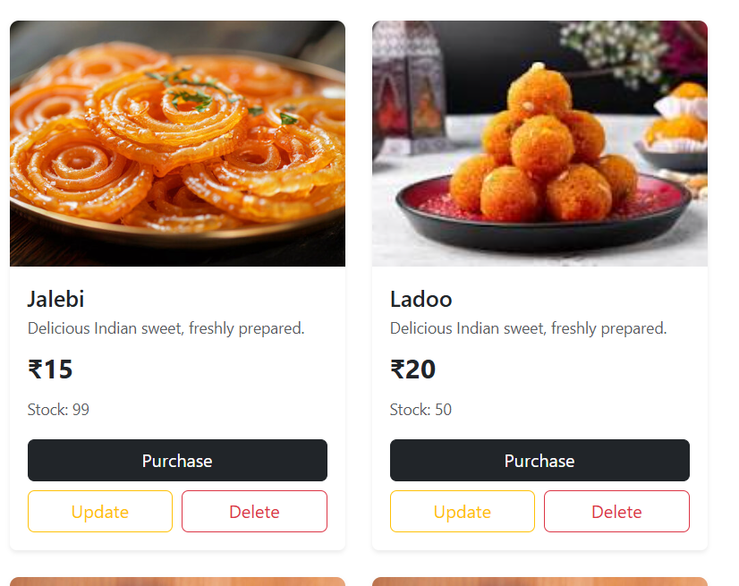
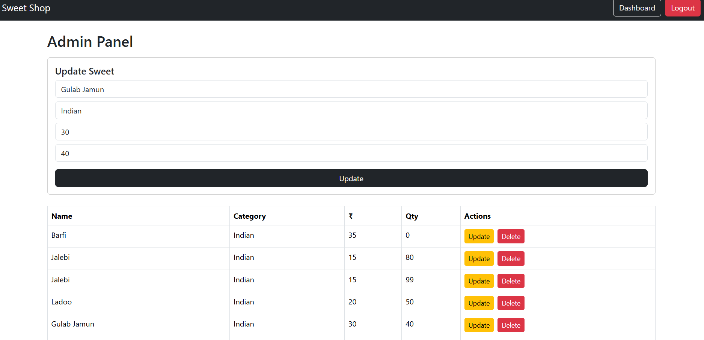

#  Sweet Shop Management System

A full-stack Sweet Shop Management application built using the **MERN stack**.
The system supports user authentication, role-based access (Admin/User),
sweet listing, purchase functionality, and admin-only management features.

---

## 📸 Screenshots

### 🏠 Home Page

### 👑 Admin Panel

### ✏️ Update Sweet (Admin)

### 🔍 Filter & Search Page

### 📝 Register Page

### 🔐 Login Page

---

## 🚀 Features

- User Registration & Login
- JWT-based Authentication
- Role-based Access Control (Admin/User)
- View available sweets
- Search and filter sweets
- Purchase sweets
- Admin-only add, edit, and delete sweets
- Backend REST APIs with Express and MongoDB

## 👑 Admin Functionality (Assessment Focus)

This project implements **role-based access control (RBAC)** using JWT.

### 🔐 Authorization
- Each user is assigned a role (`admin` or `user`) during registration.
- The role is embedded inside the JWT and decoded on the frontend.
- Admin access is granted only when `user.role === "admin"`.

### 🛡 Security Enforcement
- Admin-only backend routes are protected using middleware.
- Non-admin users receive `403 Forbidden` responses.
- Admin restrictions are enforced at both frontend and backend.

### 🧠 Design Decisions
- Single reusable form for **Add / Update** operations
- Centralized Admin Panel for inventory management
- Clean separation between user and admin responsibilities

---

## 🛠 Tech Stack

### Frontend
- React
- Bootstrap
- Axios

### Backend
- Node.js
- Express.js
- MongoDB
- Mongoose
- JWT Authentication

---

## 📁 Project Structure

sweet-shop-mgmt/
├── backend/
├── frontend/
├── screenshots/
├── README.md

